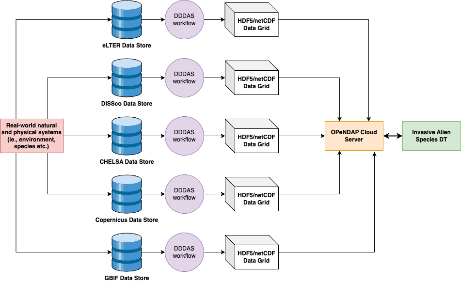

# IASDT-workflows

Data workflows for the IAS-DT, as part of BioDT.
A detailed overview can be found on the project wiki: https://wiki.eduuni.fi/x/Yg2cEw




## Folder Descriptions
- assets/ --> static assets (images, videos, etc.)
- datasets/ --> datasets divided into `raw`, `interim`, and `processed` sub-folders 
- docs/ --> software documentation
- logs/ --> logs for workflow runs
- models/ --> modeling code
- notebooks/ --> jupyter notebooks as playground and testing environment
- references/ --> reference files
- workflows/ --> Pydoit workflows
        - assimilation --> data assimilation tasks
        - download --> data download tasks
        - feedbackloop --> feedback loop tasks for "listening" to data changes
        - service --> downstream data servicing task 
- 

## Create Documentation
Run the following code to create Sphinx documentation.
```
cd docs
make html
```
