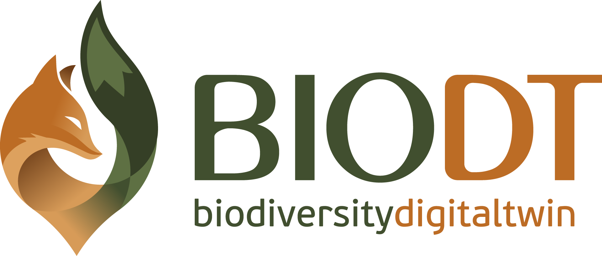
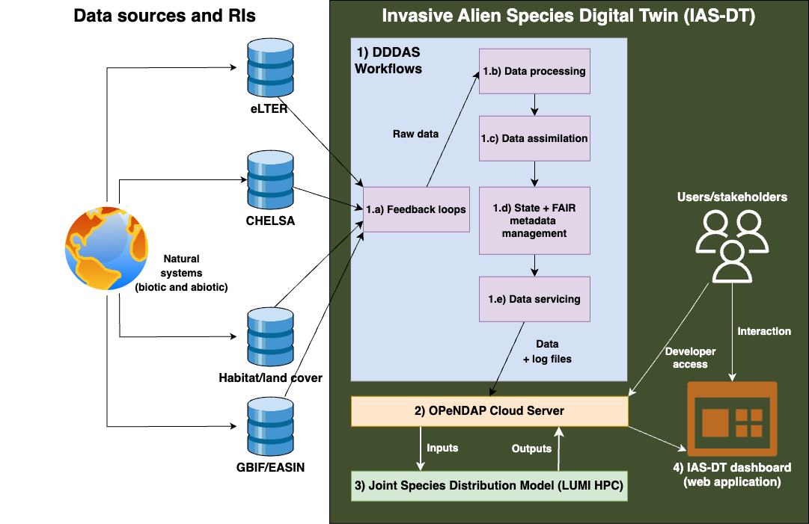
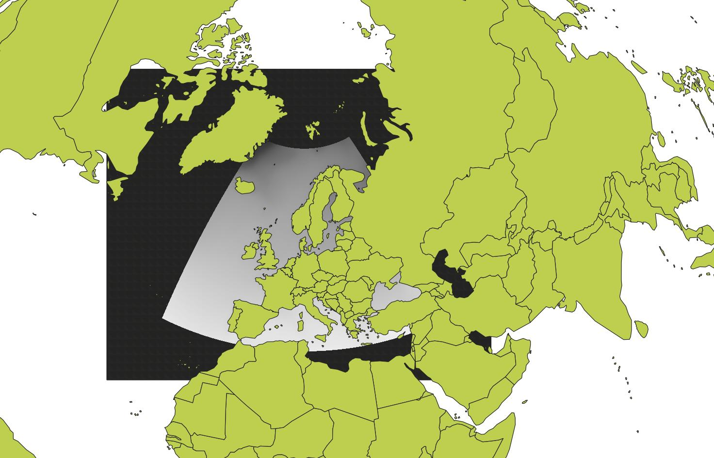

 <div align="center" style="text-align:center">
  
  <br/>
  <b>Workflows for the Invasive Alien Species Digital Twin (IASDT), as part of the Horizon Europe project tiled <a href="https://biodt.eu">Biodiversity Digital Twin</a>.</b>  
</div>

> This is a collection of PyDoit workflows for data processing, data assimilation, state management, metadata management, data and HPC servicing, and model communication.

#

## Table of Contents

- [Table of Contents](#table-of-contents)
- [Overview](#overview)
  - [Architectural overview](#architectural-overview)
  - [Study area & geospatial projection](#study-area--geospatial-projection)
- [Folder Descriptions](#folder-descriptions)
- [Usage](#usage)
- [Create Documentation](#create-documentation)
- [Logging](#logging)
- [`environment` variables: workflow parameter naming convention](#environment-variables-workflow-parameter-naming-convention)
- [Data Storage and Availability](#data-storage-and-availability)

## Overview

A detailed overview can be found on the project wiki: https://wiki.eduuni.fi/x/Yg2cEw

### Architectural overview



<br/>
<br/>

**Figure 1:** An overview of the Invasive Alien Species Digital Twin (IAS-DT) components. 1) Dynamic Data-Driven Application Systems (DDDAS) based workflows listen for changes in data sources (1.a. feedback loops), pull and process required data (1.b. data processing), merge and reconcile new and old data (1.c. data assimilation), version datasets and add metadata (1.d. state + FAIR metadata management), and transfer updated datasets (data + log files) to a data server (1.e. data servicing). 2) OPeNDAP Cloud Server services the datasets from the previous component and provides an interface to all IAS-DT data (input, output, metadata, and log files). The server also serves as an interface for third-party applications to access information contained in the IAS-DT. 3) IAS Joint Species Distribution Model is the modelling block of IAS-DT that uses input data to estimate gridded IAS numbers per habitat type. 4) IAS-DT dashboard presents aggregated results of IAS-DT in a simplified and intuitive manner to BioDT users and stakeholders and serves as a communication tool.

### Study area & geospatial projection



<br/>

**Figure 2:** Study area is defined as the area of the [EEA Reference Grid](https://www.eea.europa.eu/en/datahub/datahubitem-view/3c362237-daa4-45e2-8c16-aaadfb1a003b). The study area is divided into 10x10 km grid cells. The grid cells are projected in the [ETRS89-LAEA projection](https://epsg.io/3035) (EPSG:3035).

## Folder Descriptions

- assets/ --> static assets (images, videos, etc.)
- datasets/ --> datasets divided into `raw`, `interim`, and `processed` sub-folders
- docs/ --> software documentation
- logs/ --> logs for workflow runs
- models/ --> modeling code
- notebooks/ --> jupyter notebooks as playground and testing environment
- references/ --> reference files
- workflows/ --> Pydoit workflows
  - feedbackloop --> feedback loop tasks for "listening" to data changes and downloading datasets
  - process --> data processing tasks
  - state --> state management tasks
  - service --> downstream data servicing and HPC management tasks

## Usage

- Clone the repository to your local or cloud development environment.
- Create and configure the `.env` file with the necessary credentials and settings.
- Install all dependencies from `requirements.txt` and `renv.lock` files.
- Use the workflow directory as the current working directory.
- Run the following command in the CLI for listing available tasks: `pydoit list`
- Run all tasks and actions with pydoit command or individual - tasks using `pydoit <task-name>` command in a shell.
- Parallel task execution can be enabled by running the command `doit -n 4` (n defines the number of cores to attach to pydoit runtime).

## Create Documentation

Run the following code to create Sphinx documentation.

```
cd docs
make html
```

## Logging

> LUMI timestamps are in Finnish time

IASDT Workflows use Unix styled logging with the following logging levels:

- Warning: Warning logs
- Info: Informational logs
- Debug: Debugging logs
- Error: Errors
- Critical: Critical errors

Logging is mostly done using the `logging` module in Python. However, some tasks use the `logging` module in R. The logging module in R is a wrapper for the Python logging module. The logging module in R is used in the following tasks:

- `process/chelsa.R`
- `process/corine.R`
- `process/gbif.R`

## Environment Variables: workflow parameter naming convention

**Workflow layers**

- FL=Feedback loop
- DP=Data Processing
- DA=Data Assimilation
- SM=State Management
- MM=Metadata Management
- DS=Data Servicing
- MC=Model Communication

**Programming languages and tools**

- R=R Lang
- Py=Python Lang
- Do=Docker
- PyDo=PyDoit

**Convention**

`<layer>_<programming tools>_<data source>_<parameter name>=<parameter value>`

**Example**

DP_R_CHELSA_Gridsize=10

# Data Storage and Availability

IASDT will be using LUMI’s Object Storage ([LUMI-O](https://docs.lumi-supercomputer.eu/storage/lumio/)) for model input/output data at each workflow run in this pDT because it offers “permanent” storage. A clone of select data will be available via a data server built using the [OPeNDAP Catalog](https://git.ufz.de/khant/pydap_template) software.

LUMI-O gives a public web interface for each individual file in their “buckets”. You can find some sample data files for certain file formats below.

- CSV: https://465000357.lumidata.eu/iasdt-pub/bzf-catalogue-survey.csv
- HDF5: https://465000357.lumidata.eu/iasdt-pub/elter-vegetation.hdf5
- RData: https://465000357.lumidata.eu/iasdt-pub/Grid_10_Raster.RData
- NetCDF4: https://465000357.lumidata.eu/iasdt-pub/coads_climatology.nc

However the problem is that the entire files need to be downloaded to work within third-party systems. The OPenDAP server will clone some defined data from LUMI-O (and MinIO at UFZ for internal usage) into a VM using Docker and will serve it using the Data Access Protocol (DAP), which is a defined data model for accessing remote scientific datasets. The magic here is that DAP allows users to query subsets of the data files, while automatically giving variable-level access ([see example](http://134.94.199.14/nc/coads_climatology.nc.html)), and automatically assigning metadata to the contents of each file ([see example](http://134.94.199.14/nc/coads_climatology.nc.das)).

- **Example installation:** http://134.94.199.14/
- **Under-construction documentation:** https://khant.pages.ufz.de/opendap/chapters/concept/opendap.html
- **Template (under development):** https://git.ufz.de/khant/opendap

The IASDT will mainly work with CSV, HDF5, RData, JSON, and NetCDF file formats for data storage and availability.
