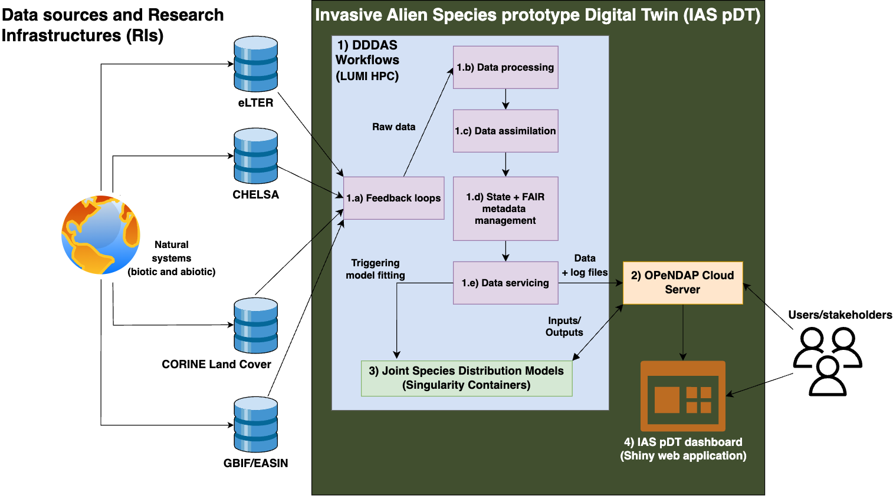
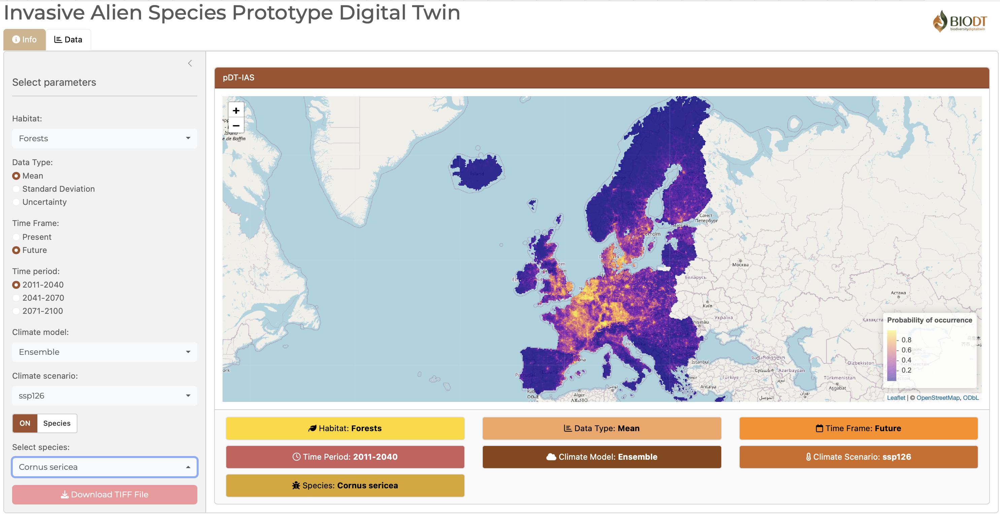

 <div align="center" style="text-align:center">
  
  <br/>
  <b>Workflows for the Invasive Alien Species Digital Twin (IASDT), as part of the Horizon Europe project tiled <a href="https://biodt.eu">Biodiversity Digital Twin</a>.</b>  
</div>

> This is a collection of PyDoit workflows for data processing, data assimilation, state management, metadata management, data and HPC servicing, and job orchestration.

#

## Table of Contents

- [](#)
  - [Table of Contents](#table-of-contents)
  - [Overview](#overview)
    - [Architectural overview](#architectural-overview)
    - [Study area \& geospatial projection](#study-area--geospatial-projection)
  - [Folder Descriptions](#folder-descriptions)
  - [Usage](#usage)
  - [Create Documentation](#create-documentation)
  - [Logging](#logging)
  - [Environment Variables](#environment-variables)
    - [Workflow parameter naming convention](#workflow-parameter-naming-convention)
  - [Model and Data processing](#model-and-data-processing)
  - [Data Storage and Availability](#data-storage-and-availability)
  - [Dashboard](#dashboard)
  - [Metadata and RO-Crates](#metadata-and-ro-crates)
  - [Containerization](#containerization)
  - [License](#license)
  - [Contributors](#contributors)

## Overview

A detailed overview can be found on the project wiki: https://wiki.eduuni.fi/x/Yg2cEw

### Architectural overview

<centre>

</centre>
<br/>
<br/>

**Figure 1:** An overview of the Invasive Alien Species Digital Twin (IASDT) components. 1) Dynamic Data-Driven Application Systems (DDDAS) based workflows listen for changes in data sources (1.a. feedback loops), pull and process required data (1.b. data processing), merge and reconcile new and old data (1.c. data assimilation), version datasets and add metadata (1.d. state + FAIR metadata management), and transfer updated datasets (data + log files) to a data server (1.e. data servicing). 2) OPeNDAP Cloud Server services the datasets from the previous component and provides an interface to all IASDT data (input, output, metadata, and log files). The server also serves as an interface for third-party applications to access information contained in the IASDT. 3) IAS Joint Species Distribution Model is the modelling block of IASDT that uses input data to estimate gridded IAS numbers per habitat type. 4) IASDT dashboard presents aggregated results of IASDT in a simplified and intuitive manner to BioDT users and stakeholders and serves as a communication tool.

### Study area & geospatial projection

<centre>

</centre>
<br/>

**Figure 2:** Study area is defined as the area of the [EEA Reference Grid](https://www.eea.europa.eu/en/datahub/datahubitem-view/3c362237-daa4-45e2-8c16-aaadfb1a003b). The study area is divided into 10x10 km grid cells. The grid cells are projected in the [ETRS89-LAEA projection](https://epsg.io/3035) (EPSG:3035).

## Folder Descriptions

- assets/ --> static assets (images, videos, etc.)
- datasets/ --> datasets divided into `raw`, `interim`, and `processed` sub-folders
- docs/ --> software documentation
- logs/ --> logs for workflow runs
- notebooks/ --> jupyter notebooks as playground and testing environment
- references/ --> reference files
- workflows/ --> Pydoit workflows
  - feedbackloop --> feedback loop tasks for "listening" to data changes and downloading datasets
  - process --> data processing tasks
  - state --> state management tasks
  - service --> downstream data servicing and HPC management tasks

## Usage

- Clone the repository to your local or cloud development environment.
- Create and configure the `.env` file with the necessary credentials and settings.
- Install all dependencies from `requirements.txt` and `renv.lock` files.
- Use the workflow directory as the current working directory.
- Run the following command in the CLI for listing available tasks: `pydoit list`
- Run all tasks and actions with pydoit command or individual - tasks using `pydoit <task-name>` command in a shell.
- Parallel task execution can be enabled by running the command `doit -n 4` (n defines the number of cores to attach to pydoit runtime).

## Create Documentation

Run the following code to create Sphinx documentation.

```
cd docs
make html
```

## Logging

> LUMI timestamps are in Finnish time

IASDT Workflows use Unix styled logging with the following logging levels:

- Warning: Warning logs
- Info: Informational logs
- Debug: Debugging logs
- Error: Errors
- Critical: Critical errors

Logging is mostly done using the `logging` module in Python. However, some tasks use `R` where scripts are submitted to the HPC slurm queue. In such cases, the logs will be stored to `.out` and `.err` files in the `logs` directory.

## Environment Variables

### Workflow parameter naming convention

The IASDT workflows use environment variables to pass parameters to the workflows. This convention is defined in the `references/parameter_naming_conventions.txt`file. The naming convention for the environment variables is as follows:

**Workflow layers**

- FL=Feedback loop
- DP=Data Processing
- DA=Data Assimilation
- SM=State Management
- MM=Metadata Management
- DS=Data Servicing
- MC=Model Communication

**Programming languages and tools**

- R=R Lang
- Py=Python Lang
- Do=Docker
- PyDo=PyDoit

**Convention**

`<layer>_<programming tools>_<data source>_<parameter name>=<parameter value>`

**Example**

DP_R_CHELSA_Gridsize=10

All the required environment variables can be found in the [`references/env-var-list.csv`](references/env-var-list.csv) file.

## Model and Data processing

The model and data processing code is developed separately in a R package called `IASDT.R`. The R package can be found in the [IASDT.R](https://github.com/BioDT/IASDT.R) Github repository. 

**IASDT.R package:** https://github.com/BioDT/IASDT.R

## Data Storage and Availability

The IASDT will use the Open-source Project for a Network Data Access Protocol (OPeNDAP) server to serve data to any application. The OPeNDAP server will be hosted on a virtual machine (VM) and will serve data from the HPC data storage systems. The OPeNDAP server will be used to serve data to third-party applications, such as the IAS Joint Species Distribution Model, and will provide an interface for users to access data stored in the IASDT.

The OPenDAP server will clone some defined data from the HPC into a VM using Docker and will serve it using the Data Access Protocol (DAP), which is a defined data model for accessing remote scientific datasets. The magic here is that DAP allows users to query subsets of the data files, while automatically giving variable-level access ([see example](http://opendap.biodt.eu/nc/coads_climatology.nc.html)), and automatically assigning metadata to the contents of each file ([see example](http://134.94.199.14/nc/coads_climatology.nc.das)).

- **Example installation:** http://opendap.biodt.eu/
- **Under-construction documentation:** https://khant.pages.ufz.de/opendap/chapters/concept/opendap.html
- **Template (under development):** https://git.ufz.de/khant/opendap

## Dashboard

The IASDT dashbaord is created using RShiny, and is linked to the DT OpenDAP server. The dashboard will be used to present the results of the IASDT to users and stakeholders in a simplified and intuitive manner. 

- **Dashboard code:** https://github.com/allantsouza/IAS-pDT-BioDT-web-app
- **Dashboard link:** https://allantsouza.shinyapps.io/IAS-pDT-BioDT-web-app/

**Sample screenshot:**

<centre>

</centre>


## Metadata and RO-Crates

The IASDT uses the Research Object Crate (RO-Crate) metadata standard to describe the data and workflows. The RO-Crate metadata standard is a community-driven specification for packaging research data with associated metadata. The RO-Crate metadata standard is designed to be machine-readable and human-readable, and it is designed to be used with a wide range of research data types, including datasets, software, and workflows.

We will use the [PyDidIt software](https://github.com/BioDT/pydidit) (developed in-house) for generating workflow crates and the RO-Crate Python library for generating RO-Crate metadata for the data. The RO-Crate metadata will be stored in the same directory as the data, and it will be used to describe the data and the workflows that generated the data.

- **RO-Crate documentation:** https://www.researchobject.org/ro-crate/
- **RO-Crate Python library:** https://pypi.org/project/ro-crate/

## Containerization 

Parts of the IASDT (specifically modelling) are containerized using Singularity containers. The containers are built using the Singularity containerization software and are used to package the IASDT modelling code and dependencies. The containers are used to run the IASDT modelling code on the HPC system, and they are used to ensure that the code runs in a consistent environment across different systems.

- **Singularity documentation:** https://sylabs.io/guides/3.7/user-guide/
- **Container template (HMSC-HPC)**: https://github.com/BioDT/hmsc-container
- **Container template (R)**: https://git.ufz.de/biodt/iasdt-modelling-containers

## License


## Contributors

- [Taimur Khan](mailto:taimur.khan@ufz.de), Helmholtz centre for environmental research - UFZ | **Workflows, Architecture, HPC, Data Processing, Containerization, Opendap server**
- [Ahmed El-Gabbas](mailto:ahmed.el-gabbas@ufz.de), Helmholtz centre for environmental research - UFZ | **IASDT.R, Modelling, Data Processing**
- [Dylan Kierans](), Containerization
- [Julian Lopez Gordillo](mailto:julian.lopezgordillo@naturalis.nl), Naturalis Biodiversity Center | **Metadata and RO-Crates**
- [Oliver Wooland](mailto:oliver.woolland@manchester.ac.uk), University of Manchester | **RO-Crates(Pydidit)**
- [Allan Souza](mailto:allan.souza@helsinki.fi) | **Dashboard**
- [Tuomas Rossi](mailto:tuomas.rossi@csc.fi) | **HPC, Containerization**


